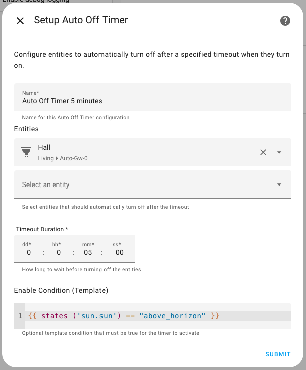

# Light Timeout

A Home Assistant custom component that automatically turns off configured lights after a user-defined timeout. When a light is turned on, a timer starts; if the timeout expires, the light is switched off. The timer is cancelled if the light is manually turned off or renewed if the light’s state is modified (e.g., brightness change). Each light has its own independent timer.

## Features

- Starts an individual timer whenever a configured light is turned on
- Automatically turns off the light when the timeout expires
- Cancels the timer if the light is manually turned off
- Renews the timer if the light’s state is modified while on
- Supports multiple lights simultaneously, each with its own timeout
- Allow creating condition(s) to be evaluated before defining the timer allowing to create a conditional timeout

## Installation

### HACS (Recommended)

1. Make sure [HACS](https://hacs.xyz/) is installed in your Home Assistant.
2. Add this repository as a custom repository in HACS:
   - Go to **HACS → Integrations → ⋮ → Custom repositories**
   - Paste the URL `https://github.com/0x3333/light_timeout`
   - Select the category **Integration**
3. Click **Download** to install
4. Restart Home Assistant

### Manual Installation

1. Copy the `light_timeout` folder into `custom_components/light_timeout` in your Home Assistant configuration directory.
2. Restart Home Assistant

> **Note:** You do not need to edit `configuration.yaml` — all configuration is done through the UI (Config Flow).

## Configuration

After installation and restart:

1. Go to **Settings → Devices & Services → Integrations**.
2. Click **Add Integration** and search for **Light Timeout**.
3. Fill out the form:
   - **Name**: a friendly title for this instance (e.g., “Living Room Timeout”).
   - **Lights**: select one or more `light.xxx` entities to monitor.
   - **Timeout**: choose a duration in “HH:MM:SS” format (e.g., “00:10:00” for 10 minutes).
   - **Condition**: you can add a condition(s) to be met when evaluating if a timeout is necessary or not.
4. Click **Submit**.

The integration will begin monitoring the selected lights. You can create as many instances (Config Entries) as you like, each with its own set of lights and timeout.

## Entities

This integration **does not** create any new entities. All behavior is handled via state listeners and native service calls (`light.turn_off`).

## Contributing

Contributions are welcome! Feel free to open a **Pull Request** or file **Issues** in the official repository.

1. Fork this repository.
2. Create a branch (`git checkout -b feature/new-feature`).
3. Commit your changes (`git commit -m 'Add new feature'`).
4. Push to the branch (`git push origin feature/new-feature`).
5. Open a Pull Request.

## License

This project is licensed under the **MIT License**. See the [LICENSE](./LICENSE) file for details.
